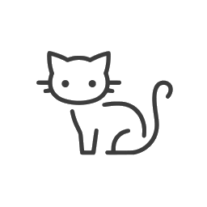

<div align="center">
  <picture>
    <source srcset="docs/icon.png" media="(prefers-color-scheme: dark)" />
    
  </picture>
  <h1>NekoHub 🐱</h1>

Fork 自 [RikkaHub](https://github.com/re-ovo/rikkahub) — 扩展了系统级 AI 工具。

[English](README_EN.md) | [繁體中文](README_ZH_TW.md)
</div>

<div align="center">
  
  
</div>

## 🚀 下载

🔗 [最新 Release](https://github.com/SlightNeko/rikkahub/releases/latest) — 自动构建、已签名、支持原地更新检测

此为 Fork 版本，未上架 Google Play。

## ✨ 新增功能（Fork 特性）

本 Fork 新增了 20+ 本地系统工具，让 AI 助手能与你的 Android 设备交互：

| 类别 | 工具 |
|----------|-------|
| 📷 **媒体** | 相机（静音拍照）、音乐控制 |
| 📍 **位置** | GPS、附近 POI（高德）、位置追踪 |
| 📅 **日程** | 日历、闹钟、时间信息 |
| 📱 **设备** | 电池、屏幕时间、应用使用轨迹、屏幕事件、剪贴板 |
| 💬 **通信** | 短信、通知监听、主动消息 |
| 💪 **健康** | Gadgetbridge 健康数据 |
| ☁️ **同步** | Supabase 云端同步 |
| ⚙️ **设置** | 权限管理、集成配置（高德 API Key、健康数据库、Supabase） |

### 设置新增
- **权限** — 一站式查看和授权所有应用权限
- **集成** — 高德 API Key、Gadgetbridge 数据库、Supabase 凭据独立管理
- **主动消息** — 配置主动消息推送间隔
- **自动压缩** — 上下文压缩完全可自定义（触发条件、目标 Token、保留消息数）

> 🐱 专属猫猫图标，浅色/深色模式自动切换

## ✨ 功能特色（来自原版 RikkaHub）

- 🎨 Material You 设计和 🌙 暗色模式
- 📦 工作区：基于 proot 的 Linux 智能体环境
- 🔄 多种 AI 供应商支持
- 🖼️ 多模态输入支持
- 🖥️ Web 多端访问
- 🛠️ MCP 支持
- 📝 Markdown 渲染
- 🪾 消息分支
- 🔍 搜索功能
- 🧩 Prompt 变量
- 🤳 二维码配置分享
- 🤖 智能体自定义
- 🧠 类 ChatGPT 记忆
- 📝 AI 翻译

## 📋 更新日志

详见 [Releases](https://github.com/SlightNeko/rikkahub/releases)

## 🔧 构建

Fork 自 [re-ovo/rikkahub](https://github.com/re-ovo/rikkahub)。

```bash
git clone https://github.com/SlightNeko/rikkahub.git
```

推送至 master 分支后通过 GitHub Actions 自动构建并发布。

> [!TIP]
> 需要在 `app` 文件夹下放置 `google-services.json` 文件以使用 Firebase。CI 会创建一个占位文件。

## 📄 许可证

与上游一致：[AGPL v3.0](LICENSE)
